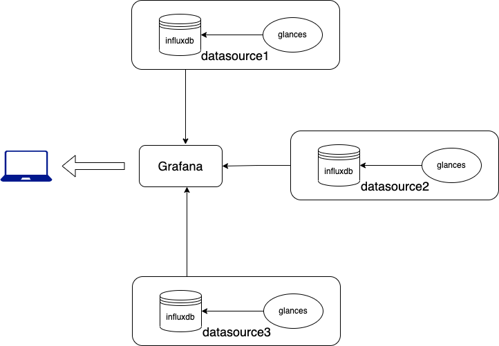
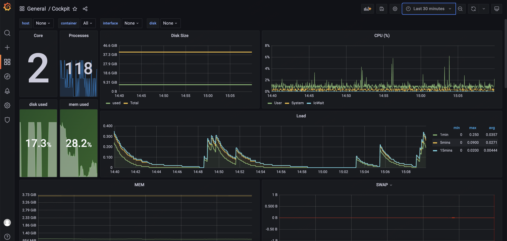
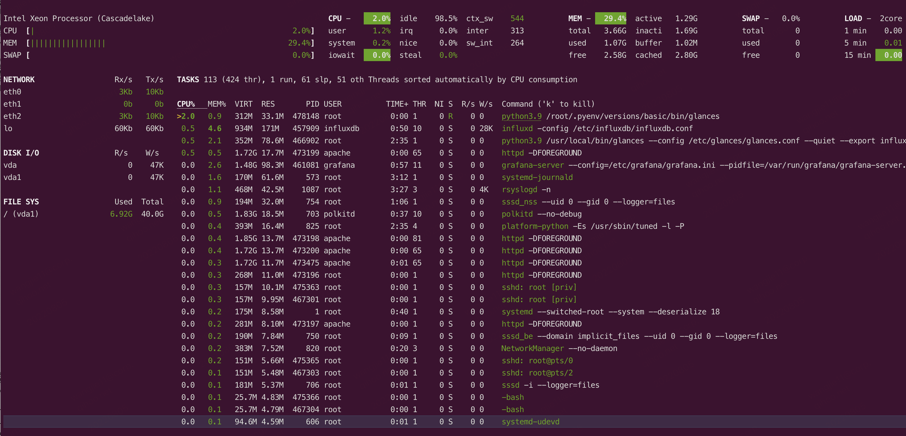
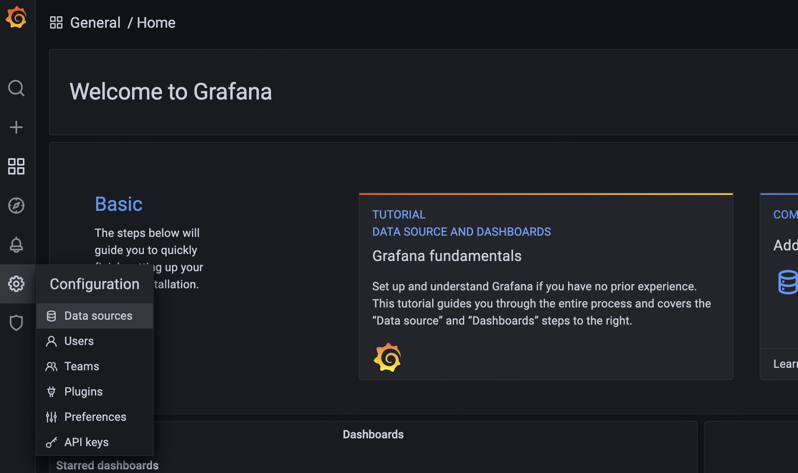
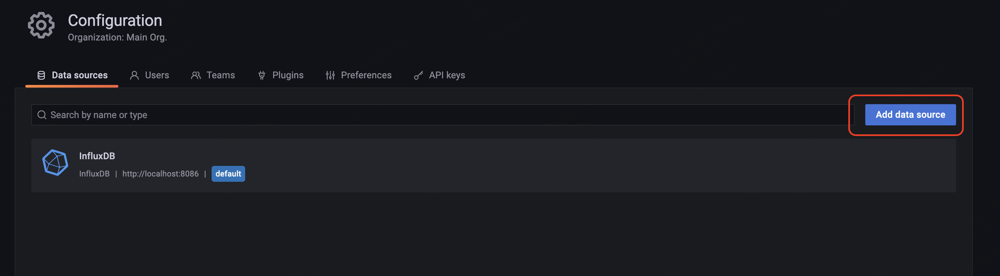
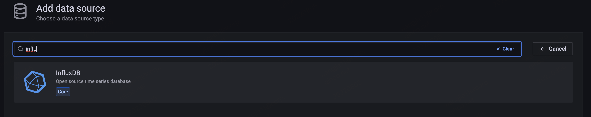
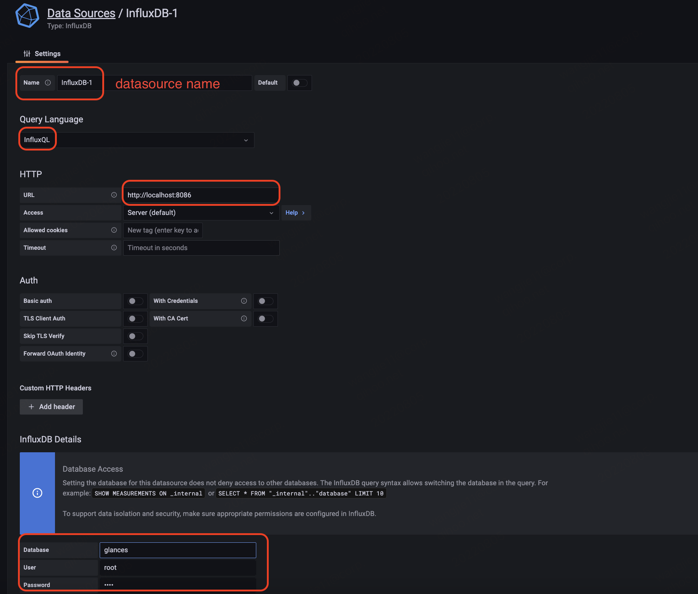
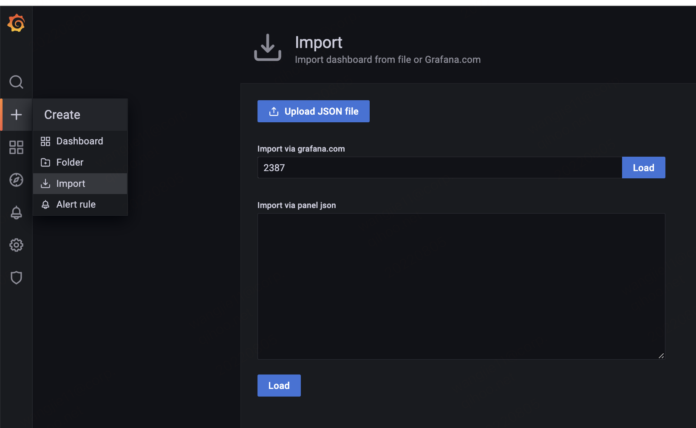
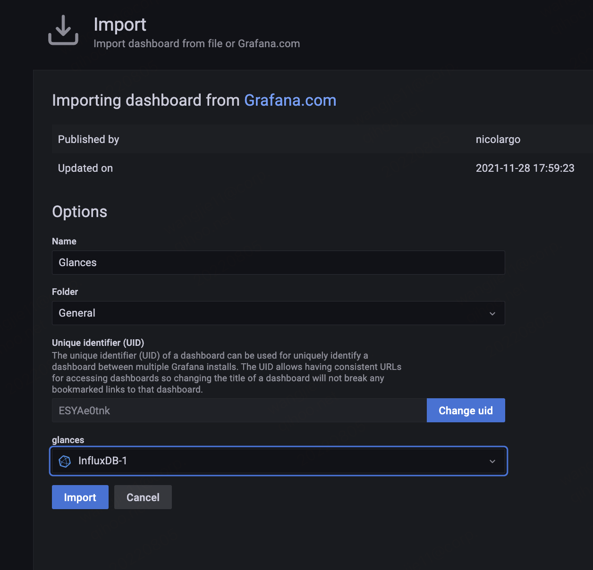

# cockpit
A monitor project for server resources basing on glances, influxdb 1.7 and grafana 8.

<center>
    
</center>

## Environment
> Python 3.9.4 <br>
> Glances 3.2.7 <br>
> Influxdb 1.7.10 <br>
> Grafana 8.5.9

## Show
<center>
    
</center>

__Major Monitored Objects:__

- CPU(%)
- Disk
- Memory
- Network

## Deploy

### Attention
There existed a dependence between influxdb and grafana and it's significant to choose the
suitable version.

> The instructions in this guide require Grafana Cloud or Grafana v7.1+. For information about
> using InfluxDB with other versions of Grafana, see the Grafana documentation.

### Glances
Glances is on PyPI, To install, simply use pip
```shell
pip install glances
```
After installing glances, we can use command ```glances``` to test it.

<center>
    
</center>


### Influxdb1.7
#### install online
[influxdata.com documents](https://docs.influxdata.com/influxdb/v1.7/introduction/installation/)

```shell
cat <<EOF | sudo tee /etc/yum.repos.d/influxdb.repo
[influxdb]
name = InfluxDB Repository - RHEL \$releasever
baseurl = https://repos.influxdata.com/rhel/\$releasever/\$basearch/stable
enabled = 1
gpgcheck = 1
gpgkey = https://repos.influxdata.com/influxdb.key
EOF
```

```shell
sudo yum install influxdb
sudo service influxdb start
```

#### install offline
```shell
cd /PATH/TO/cockpit/pkg/
yum installlocal  influxdb-1.7.10.x86_64.rpm
```

#### start influx service
```shell
sudo service influxdb start

# start, status, stop
sudo systemctl start influxdb.service
sudo systemctl status influxdb.service
sudo systemctl stop influxdb.service

## check the influx service log
# real-time
journalctl -f -u influxdb.service
# latest 100 lines
journalctl -n 100 -u influxdb.service
```

### Grafana

#### install offline
```shell
# download grafana
cd /PATH/TO/cockpit/pkg/
yum installlocal grafana-8.5.9-1.x86_64.rpm

# start the grafana service
service grafana-service satrt
```

### Combination

#### 1. Create database
```shell
influx
create database glances
use database
```

#### 2. Load glances data
```shell
# single command
glances --export influxdb

# service
vi /etc/systemd/system/glances.service

## service config, and focus on ExecStart
[Unit]
Description=Glances
After=network.target influxd.service

[Service]
ExecStart=/usr/local/bin/glances --config /etc/glances/glances.conf --quiet --export influxdb
Restart=on-failure
RestartSec=30s
TimeoutSec=30s

[Install]
WantedBy=multi-user.target

# reload the systemctl
systemctl daemon-reload
systemctl start glances.service

# auto start glance service when server start
systemctl enable glances.service
```

Try to select data from influxdb glances databases or read glances log to ensuring data loaded.
```shell
# select database data, new tables will be created if data loaded successfully.
influx
use glances
show merasurements

# use journalctl to check influxdb log
# real-time
journalctl -f -u influxdb.service 

# latest 100 log line
journalctl -n 100 -u influxdb.service 
```

#### 3. Crate Grafana Dashboard
Open http://localhost:3000 in the local browser.

<center>
    
</center>

<center>
    
</center>

<center>
    
</center>

<center>
    
</center>

The datasource was created, and then we need to import the dashboard.

<center>
    
</center>

<center>
    
</center>

Finally, click the import to finish creating the monitor program.

## Reference
1. [Grafana Office](https://grafana.com/)
2. [Glances Ofiice](https://nicolargo.github.io/glances/)
3. [Influx 1.7 Office Doc](https://docs.influxdata.com/influxdb/v1.7/)
4. [Glances, InfluxDB, Glances](https://glances.readthedocs.io/en/latest/gw/influxdb.html)